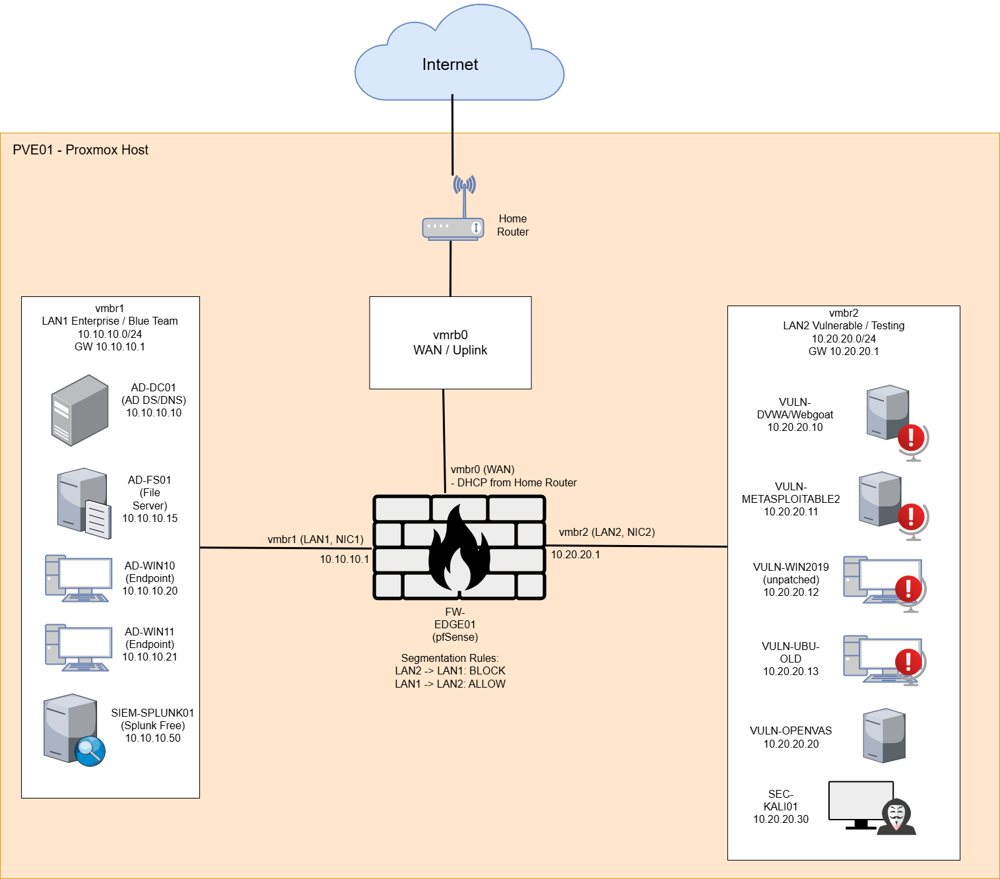

# P1-2: Telemetry Pipeline

P1-2 is part of Portfolio 1 (P1) — Lab Infrastructure, Telemetry, and Investigation Case Files

**Portfolio Hub:** [Cybersecurity Portfolio 1](https://github.com/kvatnynito/Cybersecurity-Portfolio1)

## Overview

This repo documents the buildout of a telemetry pipeline that starts by proving initial log flow into **Splunk**, then expands into **Windows Event Forwarding (WEF)**, **Sysmon**, **Wazuh**, and **Elastic** validation.

The goal is to practice realistic SOC workflows: collecting endpoint signals, confirming end-to-end delivery, and building repeatable investigation pivots across multiple platforms.

This project is part of Portfolio 1 and begins after `P1-1-proxmox-segmentation-lab`.

---

## Current Status

**Current status:** Active  
**Execution status:** Milestone 7 — Collector Placement and First Endpoint Prep  
**Prerequisite:** `P1-1-proxmox-segmentation-lab`

P1-1 established the segmented Proxmox lab foundation and validated that Splunk Web UI is reachable. P1-2 is now focused on proving that pfSense and Windows logs can flow into Splunk before moving into collector placement, Sysmon, WEF, Wazuh, or Elastic work.

Milestone 6 is complete. pfSense syslog forwarding validated on UDP `5514` (901+ events, host=10.10.10.1) and Windows Event Log forwarding validated via Splunk Universal Forwarder on TCP `9997` (WinEventLog:Security confirmed, host=DESKTOP-8K5AHHR). Milestone 7 begins next: collector placement decision and first endpoint prep.

---

## Sanitization Note

For safety, this repo uses **representative** hostnames and IP ranges and redacts any WAN/public IPs, domains/DDNS, VPN details, and secrets.

The architecture and workflow are intended to remain accurate, but specific identifiers may be modified.

---

## Why I’m Building This

I wanted a setup that mirrors how teams centralize endpoint telemetry in the real world:

- **WEF** to centralize Windows logs without installing heavy agents everywhere
- **Sysmon** to add high-value visibility such as process creation, network connections, image loads, and related endpoint behavior
- multiple destinations (**Wazuh / Elastic / Splunk**) so I can compare how each platform supports triage and investigation workflows

This repo is meant to help me practice not just collecting telemetry, but also validating that it moves end-to-end and becomes usable for analysis.

---

## Planned Project Goals

This project is intended to demonstrate:

- setting up **WEF (source-initiated subscription)** to forward Security and Sysmon events from endpoints to a collector
- deploying **Sysmon** with a tuned configuration on lab endpoints
- ingesting that telemetry into **Wazuh**, **Elastic**, and **Splunk**
- validating the pipeline using known test events
- capturing screenshots and notes that prove successful end-to-end delivery

---

## Milestone Tracker

> Note: P1-2 begins after Milestone 5 is completed in `P1-1-proxmox-segmentation-lab`.
> Milestones 1–5 belong to P1-1 and cover the segmented lab foundation.
>
> Splunk was installed and its Web UI was validated in P1-1, but telemetry ingestion was not yet tested.
> The first actionable milestone in P1-2 is Milestone 6: proving initial log flow into Splunk.

- [x] Milestone 6: Prove pfSense and Windows logs flow into Splunk
- [ ] Milestone 7: Decide collector placement and prepare first Windows endpoint
- [ ] Milestone 8: Deploy Sysmon and confirm local event generation
- [ ] Milestone 9: Configure WEF and confirm collector-side event receipt
- [ ] Milestone 10: Validate telemetry ingestion in Wazuh, Elastic, and Splunk
- [ ] Milestone 11: Add `LAN1-FILE01` and expand Windows telemetry coverage
- [ ] Milestone 12: Add `AD-WIN11` and expand endpoint coverage
- [ ] Milestone 13: Add `VULN-DVWA01` and validate web activity telemetry
- [ ] Milestone 14: Add `TEST-WIN2019-LAN2` and validate Windows server telemetry
- [ ] Milestone 15: Add `SCAN-OPENVAS01` and review scan-generated telemetry
- [ ] Milestone 16: Optional `VULN-WEBGOAT01` telemetry expansion
- [ ] Milestone 17: Optional `VULN-UBU-OLD` telemetry expansion

---

## Planned Workflow

The intended workflow for this repo is:

### 1. Prove initial Splunk ingestion
- confirm Splunk is running and reachable
- configure pfSense syslog forwarding to Splunk
- configure Windows Event Log forwarding from the first Windows endpoint
- validate both log sources in Splunk searches

### 2. Decide collector placement
- choose between `AD-DC01` and a dedicated `WEC01`
- document the reasoning and design impact

### 3. Prepare supporting hosts
- finalize which additional hosts are needed for telemetry generation and validation
- add supporting hosts only when they serve a telemetry, validation, detection, or investigation purpose

### 4. Deploy Sysmon to endpoints
- install Sysmon on Windows lab endpoints
- apply a tuned configuration
- confirm event generation locally

### 5. Configure WEF
- create a source-initiated subscription
- forward selected Security and Sysmon events to the collector
- confirm event arrival in Event Viewer

### 6. Send telemetry to downstream platforms
- validate Wazuh ingestion
- validate Elastic ingestion
- validate Splunk ingestion

### 7. Run test activity and collect evidence
- generate known test events
- confirm visibility in each platform
- capture screenshots and notes
- document issues, gaps, and improvements

---

## Planned Deliverables

This repo is expected to eventually include:

- WEF configuration notes
- Sysmon deployment and configuration notes
- pipeline diagrams
- screenshots of collector-side event validation
- screenshots of Wazuh ingestion
- screenshots of Elastic ingestion
- screenshots of Splunk ingestion
- supporting host onboarding notes where relevant
- test-event validation notes
- documentation of investigation pivots and lessons learned

---

## Planned Next Steps

The current implementation focus is Milestone 6:

- completed: confirmed Splunk is installed and running on `SIEM-SPLUNK01`
- completed: confirmed Splunk Web UI is reachable from `TEST-WIN10-LAN1`
- completed: configured Splunk to receive pfSense syslog on UDP `5514`
- completed: configured pfSense to forward logs to `SIEM-SPLUNK01`
- completed: validated pfSense logs in Splunk
- next: configure Windows Event Log forwarding from `TEST-WIN10-LAN1`
- next: validate Windows logs in Splunk
- next: document remaining source IPs, ports, screenshots, and validation searches

---

## Dependencies

This project is planned to be implemented on the segmented lab documented in:

- `P1-1-proxmox-segmentation-lab`

Planned hosts used during implementation:

- **Collector:** TBD (`AD-DC01` vs dedicated `WEC01`)
- **Endpoints:** `AD-WIN10` / `AD-WIN11`
- **Supporting hosts as needed:** `LAN1-FILE01`, `VULN-DVWA01`, `TEST-WIN2019-LAN2`, `SCAN-OPENVAS01`
- **Destinations:** Wazuh / Elastic / Splunk

---

## Network Diagram

**Design intent:** `FW-EDGE01` (pfSense) provides WAN access and acts as the central routing and segmentation point between **LAN1 (enterprise / blue-team)** and **LAN2 (vulnerable / testing)**.

---

## Architecture (High Level)

### Flow (Planned)
Endpoints (domain-joined Windows)  
→ **WEF Collector** (TBD: `AD-DC01` vs dedicated collector)  
→ **Wazuh / Elastic / Splunk**

---

## Why Each Component Is Included

- **WEF (Windows Event Forwarding)**  
  **Why it’s included:** I want a realistic and scalable way to centralize Windows events without depending entirely on one vendor’s collection method.

- **Sysmon**  
  **Why it’s included:** Sysmon adds the kind of visibility that makes investigations practical, especially around process activity, parent-child relationships, and network behavior.

- **Wazuh**  
  **Why it’s included:** I want experience with an open-source security platform that supports alerting, event review, and endpoint visibility.

- **Elastic**  
  **Why it’s included:** Elastic is useful for fast searching and field-based pivots, which makes it a strong platform for investigation workflows.

- **Splunk**  
  **Why it’s included:** Splunk is common in SOC environments, and I want hands-on repetition with SPL searches and triage patterns.

## What’s Next

This repo builds the telemetry foundation for [P1-3: Incident Investigation Case Files](https://github.com/kvatnynito/P1-3-incident-investigation-casefiles):

- simulated security activity using the segmented lab zones from P1-1
- investigation case files built from validated telemetry in Splunk, Wazuh, and Elastic
- timelines, queries, evidence screenshots, and analyst conclusions
- follow-up notes for detection tuning, logging gaps, and hardening improvements
