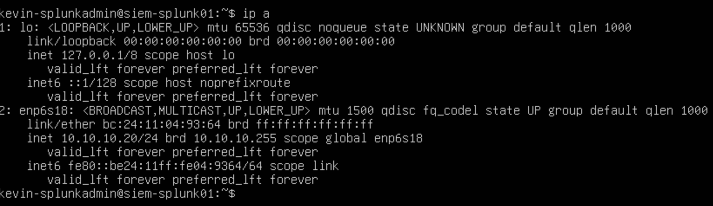
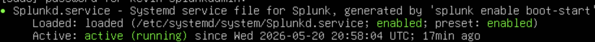
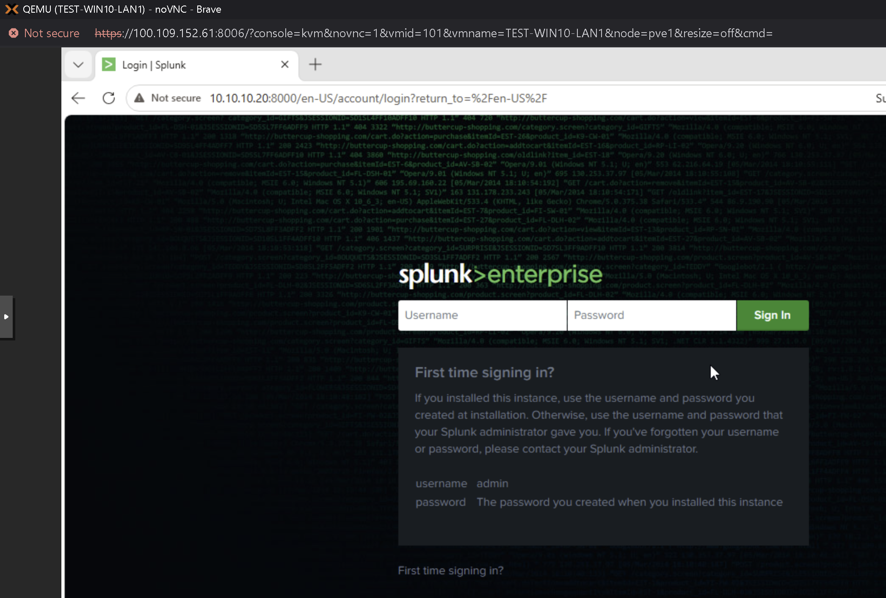
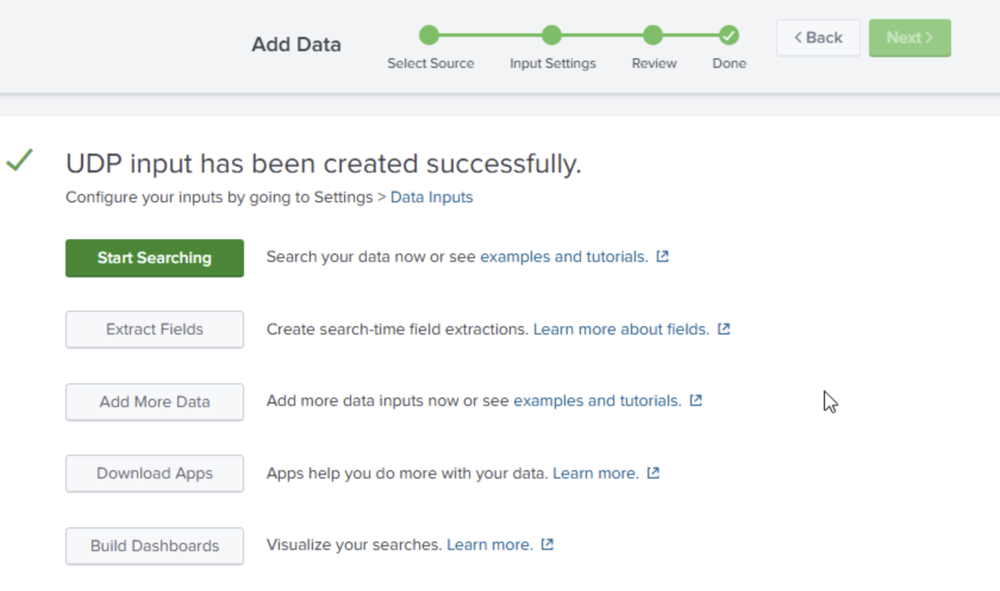
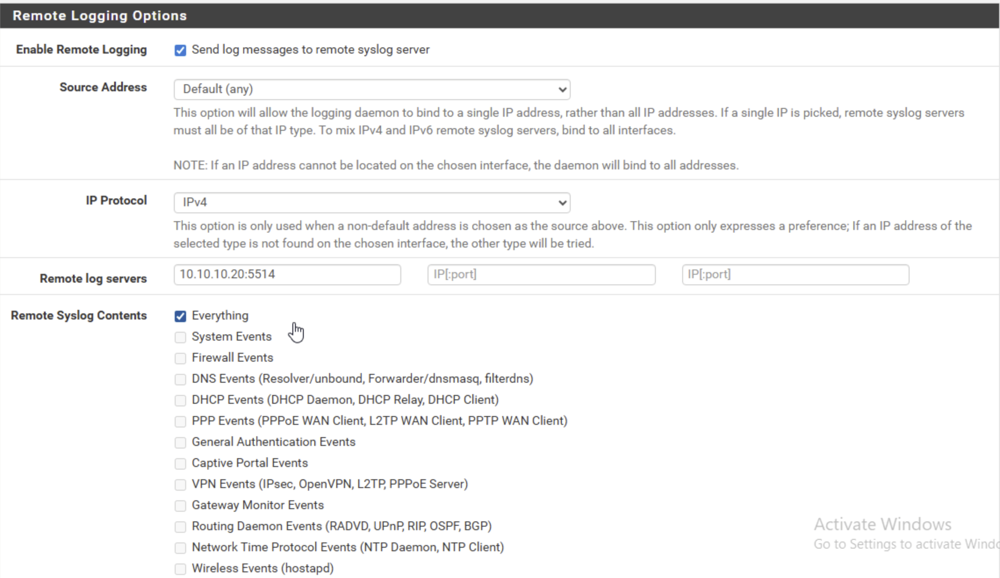
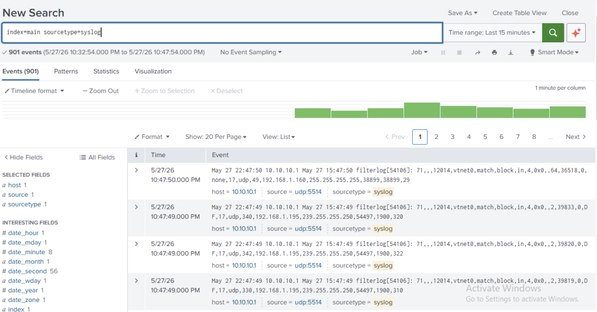
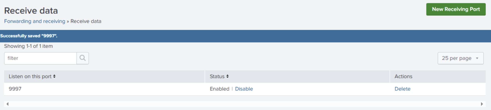
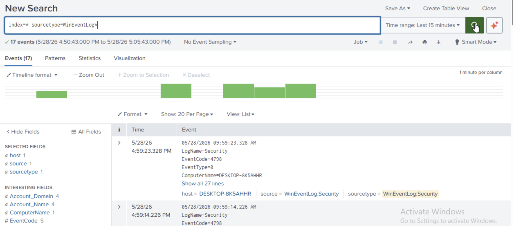

# Milestone Schedule

## Purpose

This file is the roadmap source of truth for the Telemetry Pipeline project.

Use this file to track:

- milestone order
- milestone goals
- telemetry onboarding sequence
- supporting host additions
- completion criteria
- portfolio artifact ideas
- validation checkpoints
- when additional telemetry-supporting VMs should be added

This file shows the intended project roadmap for P1-2 only. For the current live stopping point, use:

- `docs/current-status.md`

---

# Current Project Position

## Current Milestone

- Milestone 8 — Sysmon Deployment and Local Validation

## Completed Milestones

- Milestone 6 — Logging Foundation
- Milestone 7 — Collector Placement and First Endpoint Prep

## Transition Note

P1-2 begins after P1-1 is completed.

Milestones 1–5 belong to `P1-1-proxmox-segmentation-lab` and cover the segmented lab foundation.

The segmented lab foundation already exists in `P1-1-proxmox-segmentation-lab`, including:

- `FW-EDGE01`
- `AD-DC01`
- `TEST-WIN10-LAN1`
- `TEST-WIN10-LAN2`
- `ATTACK-KALI01`
- `VULN-METASPLOITABLE2`
- `SIEM-SPLUNK01`

This repo focuses on telemetry (the stream of log and event data collected from systems to support monitoring and investigation) collection, forwarding, validation, and investigation readiness.

Splunk was installed and its Web UI was validated in P1-1, but telemetry ingestion was not yet tested.

The first actionable milestone in this repo is Milestone 6: prove initial log flow into Splunk before expanding the telemetry design or adding more hosts.

Additional hosts may be created during this project, but only when they support telemetry, detection, or investigation workflows.

---

## Milestone 6 — Logging Foundation

### Goal

Prove that pfSense (an open-source firewall and router acting as the network gateway in this lab) and Windows logs flow into Splunk before expanding the lab.

### Core Rule

Do not add more VMs during this milestone unless Splunk logging is working first.

### Tasks

- Confirm Splunk is installed and running on `SIEM-SPLUNK01`.
- Confirm Splunk Web UI is reachable.
- Create a Splunk UDP (User Datagram Protocol — a fast, connectionless way to send data over a network, common for log delivery) network input on port `5514` for pfSense syslog (a standard format that network devices like firewalls use to send log messages).
- Configure pfSense logs to forward to `SIEM-SPLUNK01`.
- Verify pfSense firewall logs appear in Splunk.
- Configure Windows log forwarding from `TEST-WIN10-LAN1`.
- Prefer Splunk Universal Forwarder (a lightweight agent installed on an endpoint that ships its logs to a central SIEM) for the first Windows source unless there is a reason to use WEF (Windows Event Forwarding — a built-in Windows feature that pushes event logs from endpoint machines to a central collector) immediately.
- Verify Windows logs appear in Splunk.
- Document log sources in GitHub.

### Expected Log Source Map

| Source | Destination | Method | Port | Status |
|---|---|---|---:|---|
| `FW-EDGE01` / pfSense | `SIEM-SPLUNK01` (SIEM — Security Information and Event Management — a platform that collects, stores, and searches log data from many sources) | Syslog | UDP 5514 | Validated |
| `TEST-WIN10-LAN1` | `SIEM-SPLUNK01` | Splunk Universal Forwarder | TCP (Transmission Control Protocol — a reliable, connection-based way to send data that confirms delivery) 9997 | Validated |

### Milestone 6 Configuration Notes

- pfSense syslog requires a Splunk UDP network input before firewall logs can be ingested.
- UDP `5514` is preferred for this lab instead of UDP `514` because it avoids binding Splunk directly to the standard privileged syslog port.
- The chosen Splunk index and sourcetype for pfSense syslog should be documented once selected so validation searches are repeatable.
- Initial pfSense syslog input uses sourcetype (a label Splunk uses to identify what kind of log data came in, so it knows how to parse it) `syslog` and index (the storage bucket Splunk uses to organize incoming log data) `default` / `main` until a dedicated pfSense index or parser is intentionally added.

### Completion Criteria

Milestone 6 is complete only when:

- pfSense forwards logs to `SIEM-SPLUNK01`.
- Splunk displays pfSense logs.
- `TEST-WIN10-LAN1` sends logs to Splunk.
- Splunk displays Windows logs.
- GitHub documentation includes source IPs, ports, screenshots, and validation searches.

### Portfolio Artifact Ideas

- `docs/milestone-06-logging-foundation.md`
- `docs/milestone-06-splunk-pfsense-syslog-setup.md`
- `docs/milestone-06-windows-forwarder-onboarding.md`

### Status

Complete.

### Validation Evidence

- `SIEM-SPLUNK01` confirmed at IP `10.10.10.20/24` on the management network.
- Screenshot: `screenshots/milestone06-siem-splunk01-ip-confirmed.png`



- Splunk service confirmed active (running) on `SIEM-SPLUNK01`.
- Screenshot: `screenshots/milestone06-splunk-service-running.png`



- Splunk Web UI reachable from `TEST-WIN10-LAN1` at `http://10.10.10.20:8000`.
- Screenshot: `screenshots/milestone06-splunk-web-ui-reachable-from-win10.png`



- Splunk UDP `5514` input created for pfSense syslog with sourcetype `syslog` and index `default` / `main`.
- Screenshot: `screenshots/milestone06-splunk-udp5514-input-configured.png`



- pfSense remote logging configured to send to `SIEM-SPLUNK01` at `10.10.10.20:5514`.
- Screenshot: `screenshots/milestone06-pfsense-remote-logging-configured-udp5514.png`



- Splunk validation search `index=main sourcetype=syslog` returned 901 pfSense events with host `10.10.10.1`, source `udp:5514`, and filterlog (pfSense's built-in logging format for firewall rule activity) entries visible.
- Screenshot: `screenshots/milestone06-splunk-pfsense-events-visible.png`



- Splunk Universal Forwarder installed on `TEST-WIN10-LAN1`, pointed at `10.10.10.20:9997`. `inputs.conf` (a Splunk forwarder configuration file that defines which logs to collect and send) manually created with Application, Security, and System channels enabled.
- Splunk TCP `9997` receiving port enabled on `SIEM-SPLUNK01`.
- Screenshot: `screenshots/milestone06-splunk-tcp9997-receiving-enabled.png`



- Splunk validation search `index=* sourcetype=WinEventLog*` returned Windows Security events with host `DESKTOP-8K5AHHR`, sourcetype `WinEventLog:Security`.
- Screenshot: `screenshots/milestone06-splunk-windows-events-visible.png`



---

## Milestone 7 — Collector Placement and First Endpoint Prep

### Goal

Decide collector placement and prepare the first Windows endpoint for the next telemetry phase.

### Tasks

- Decide whether the collector (a Windows machine that receives forwarded logs from multiple endpoints) will be `AD-DC01` (domain controller — the Windows Server that manages user accounts, authentication, and group policy for the domain) or a dedicated `WEC01` (Windows Event Collector — the server-side role that receives forwarded Windows logs).
- Document reasoning and design tradeoffs.
- Confirm first endpoint selection for WEF/Sysmon onboarding.
- Prepare the endpoint for the next telemetry phase.
- Confirm the endpoint is reachable and ready for additional logging configuration.

### Expected Result

- Collector placement decision is documented.
- First endpoint is chosen and ready.
- The next telemetry path beyond direct Splunk ingestion has a defined starting point.

### Portfolio Artifact Ideas

- `docs/milestone-07-collector-placement-decision.md`
- `docs/milestone-07-first-endpoint-prep.md`

### Status

Complete.

Collector placement is decided: a dedicated `WEC01` collector has been selected instead of placing the WEF collector role on `AD-DC01`. `WEC01` has been provisioned, assigned static IP `10.10.10.30`, joined to `corp.local`, and validated for domain controller discovery against `AD-DC01` at `10.10.10.10`.

`TEST-WIN10-LAN1` endpoint readiness is validated. The endpoint is joined to `corp.local`, receives `AD-DC01` (`10.10.10.10`) as DNS through pfSense DHCP, resolves `corp.local`, resolves `WEC01.corp.local` to `10.10.10.30`, and reaches `WEC01` on WinRM TCP `5985`. ICMP ping to `WEC01` is blocked or unvalidated, but the WEF-relevant WinRM path is reachable.

---

## Milestone 8 — Sysmon Deployment and Local Validation

### Goal

Deploy Sysmon (a free Microsoft tool that records detailed system activity like process launches and network connections) and confirm local event generation on the first Windows endpoint.

### Tasks

- Install Sysmon on the first Windows endpoint.
- Apply a tuned configuration.
- Confirm Sysmon service is running.
- Generate basic local activity.
- Confirm Sysmon events are visible locally.
- Document the configuration and validation evidence.

### Completion Criteria

Milestone 8 is complete only when:

- Sysmon is installed.
- Sysmon is running.
- Local Sysmon events are generated.
- Validation evidence is documented.

### Portfolio Artifact Ideas

- `docs/milestone-08-sysmon-deployment.md`
- `docs/milestone-08-sysmon-local-validation.md`

### Status

Active - not started.

Milestone 8 should start with local Sysmon deployment and Event Viewer validation on `TEST-WIN10-LAN1`. Do not configure WEF subscriptions until local Sysmon event generation is validated.

---

## Milestone 9 — WEF Configuration and Collector Validation

### Goal

Configure WEF and confirm event receipt at the collector.

### Tasks

- Configure a source-initiated WEF subscription (a WEF configuration that tells the collector which endpoints to pull logs from and which events to collect).
- Forward selected Security and Sysmon events.
- Confirm event arrival on the collector.
- Document subscription choices.
- Save screenshots and validation notes.

### Completion Criteria

Milestone 9 is complete only when:

- WEF subscription is configured.
- Security and Sysmon events arrive at the collector.
- Validation evidence is documented.

### Portfolio Artifact Ideas

- `docs/milestone-09-wef-subscription-setup.md`
- `docs/milestone-09-collector-event-validation.md`

### Status

Planned.

---

## Milestone 10 — Multi-Platform Ingestion Validation

### Goal

Validate telemetry ingestion (the process of receiving log data into a platform like Splunk) in Wazuh (an open-source security platform that collects agent data, generates alerts, and supports endpoint monitoring), Elastic (the Elasticsearch and Kibana stack — a search and visualization platform used to store and query log data), and Splunk.

### Tasks

- Confirm telemetry reaches Wazuh.
- Confirm telemetry reaches Elastic.
- Confirm telemetry reaches Splunk.
- Run test activity and verify searchability in each platform.
- Capture screenshots and validation notes.

### Completion Criteria

Milestone 10 is complete only when:

- Telemetry is searchable in Wazuh.
- Telemetry is searchable in Elastic.
- Telemetry is searchable in Splunk.
- Validation evidence is documented.

### Portfolio Artifact Ideas

- `docs/milestone-10-wazuh-ingestion-validation.md`
- `docs/milestone-10-elastic-ingestion-validation.md`
- `docs/milestone-10-splunk-ingestion-validation.md`

### Status

Planned.

---

## Milestone 11 — File Server Telemetry Expansion

### Goal

Add `LAN1-FILE01` and expand Windows telemetry coverage.

### Tasks

- Create `LAN1-FILE01`.
- Connect `LAN1-FILE01` to LAN1 / vmbr1.
- Configure static IP.
- Join the system to the domain if appropriate.
- Create a basic SMB (Server Message Block — a Windows file-sharing protocol) file share.
- Generate file activity and authentication activity.
- Onboard the host into the telemetry pipeline.
- Validate visibility in the collector and downstream platforms.
- Document findings.

### Add This VM

| VM Name | Role | Network | Status |
|---|---|---|---|
| `LAN1-FILE01` | File server / SMB telemetry source | LAN1 / vmbr1 | Planned Milestone 11 |

### Why This Matters

This host creates realistic enterprise telemetry such as SMB activity, authentication events, file operations, and permissions-related behavior.

### Portfolio Artifact Ideas

- `docs/milestone-11-file-server-onboarding.md`
- `docs/milestone-11-smb-telemetry-validation.md`

### Status

Planned.

---

## Milestone 12 — Second Endpoint Telemetry Expansion

### Goal

Add `AD-WIN11` and expand endpoint telemetry coverage.

### Tasks

- Create `AD-WIN11`.
- Connect `AD-WIN11` to LAN1 / vmbr1.
- Join `AD-WIN11` to the domain.
- Onboard the endpoint into the telemetry pipeline.
- Generate endpoint activity:
  - logon
  - failed logon
  - PowerShell usage
  - file share access
- Validate visibility in the collector and downstream platforms.
- Document endpoint onboarding.

### Add This VM

| VM Name | Role | Network | Status |
|---|---|---|---|
| `AD-WIN11` | Second domain-joined Windows telemetry endpoint | LAN1 / vmbr1 | Planned Milestone 12 |

### Portfolio Artifact Ideas

- `docs/milestone-12-ad-win11-onboarding.md`
- `docs/milestone-12-endpoint-telemetry-validation.md`

### Status

Planned.

---

## Milestone 13 — DVWA Telemetry Source

### Goal

Add `VULN-DVWA01` and validate web activity telemetry.

### Tasks

- Create `VULN-DVWA01`.
- Connect `VULN-DVWA01` to LAN2 / vmbr2.
- Install Ubuntu Server.
- Install Docker.
- Deploy DVWA (Damn Vulnerable Web Application — a deliberately insecure web app used for security testing practice).
- Confirm DVWA is reachable from `ATTACK-KALI01`.
- Generate basic web traffic.
- Validate relevant firewall, IDS, and SIEM visibility.
- Document setup and findings.

### Add This VM

| VM Name | Role | Network | Status |
|---|---|---|---|
| `VULN-DVWA01` | Vulnerable web telemetry source | LAN2 / vmbr2 | Planned Milestone 13 |

### Portfolio Artifact Ideas

- `docs/milestone-13-dvwa-setup.md`
- `docs/milestone-13-dvwa-telemetry-validation.md`

### Status

Planned.

---

## Milestone 14 — Windows Server Telemetry Source

### Goal

Add `TEST-WIN2019-LAN2` and validate Windows Server telemetry.

### Tasks

- Create `TEST-WIN2019-LAN2`.
- Connect `TEST-WIN2019-LAN2` to LAN2 / vmbr2.
- Install Windows Server 2019 evaluation.
- Configure static IP.
- Enable selected services for testing.
- Onboard the server into the telemetry pipeline as appropriate.
- Generate Windows Server activity.
- Validate telemetry visibility.
- Document baseline configuration.

### Naming Rule

Name it first as `TEST-WIN2019-LAN2`.

Later, when intentionally weakened, document it as `VULN-WIN2019`.

Do not call it vulnerable before it is actually misconfigured.

### Add This VM

| VM Name | Role | Network | Status |
|---|---|---|---|
| `TEST-WIN2019-LAN2` | Windows Server telemetry source | LAN2 / vmbr2 | Planned Milestone 14 |
| `VULN-WIN2019` | Intentionally weakened Windows Server target | LAN2 / vmbr2 | Future state after misconfiguration |

### Portfolio Artifact Ideas

- `docs/milestone-14-windows-server-onboarding.md`
- `docs/milestone-14-windows-server-telemetry-validation.md`

### Status

Planned.

---

## Milestone 15 — Vulnerability Scan Telemetry

### Goal

Add `SCAN-OPENVAS01` and review scan-generated telemetry.

### Tasks

- Create `SCAN-OPENVAS01`.
- Connect `SCAN-OPENVAS01` to LAN2 / vmbr2.
- Install Greenbone/OpenVAS.
- Configure scanner.
- Run scans against selected targets.
- Review firewall, IDS, and SIEM telemetry generated by scanning.
- Export or screenshot scan results.
- Document findings.

### Add This VM

| VM Name | Role | Network | Status |
|---|---|---|---|
| `SCAN-OPENVAS01` | Vulnerability scanner / telemetry generator | LAN2 / vmbr2 | Planned Milestone 15 |

### Naming Note

Use `SCAN-OPENVAS01`, not `VULN-OPENVAS01`.

OpenVAS is the scanner, not the victim.

### Portfolio Artifact Ideas

- `docs/milestone-15-openvas-setup.md`
- `docs/milestone-15-scan-telemetry-review.md`

### Status

Planned.

---

## Milestone 16 — Optional WebGoat Telemetry Expansion

### Goal

Add `VULN-WEBGOAT01` as an optional second vulnerable web telemetry source.

### Tasks

- Create `VULN-WEBGOAT01`.
- Connect `VULN-WEBGOAT01` to LAN2 / vmbr2.
- Install Ubuntu Server.
- Install Docker.
- Deploy WebGoat.
- Confirm access from `ATTACK-KALI01`.
- Generate basic web traffic.
- Validate relevant telemetry.
- Document setup.

### Add This VM

| VM Name | Role | Network | Status |
|---|---|---|---|
| `VULN-WEBGOAT01` | Optional vulnerable web telemetry source | LAN2 / vmbr2 | Optional Milestone 16 |

### Status

Optional / Planned.

---

## Milestone 17 — Optional Outdated Linux Telemetry Expansion

### Goal

Add `VULN-UBU-OLD` as an optional outdated Linux telemetry source.

### Tasks

- Create `VULN-UBU-OLD`.
- Connect `VULN-UBU-OLD` to LAN2 / vmbr2.
- Install older Ubuntu version.
- Configure selected services.
- Avoid full hardening.
- Run scans or test activity against it.
- Review resulting telemetry.
- Document findings.

### Add This VM

| VM Name | Role | Network | Status |
|---|---|---|---|
| `VULN-UBU-OLD` | Optional outdated Linux telemetry source | LAN2 / vmbr2 | Optional Milestone 17 |

### Status

Optional / Planned.

---

# Milestone Tracker Reference

Use the milestone tracker in `README.md` as the public-facing progress summary.

Use this file as the detailed internal roadmap and milestone-definition reference.

If `README.md` and this file ever disagree, update both so milestone status, stopping point, and next action stay aligned.

For P1-2, milestone numbering continues from P1-1 so the dependency remains obvious across the portfolio.

---

# Investigation Direction

After the core telemetry pipeline is validated, later work can branch into:

- authentication investigations
- Sysmon process analysis
- PowerShell activity review
- scan detection
- web attack review
- endpoint comparison across platforms
- tuning and filtering improvements

This repo should stay focused on making telemetry usable, searchable, and validated before deeper casework expands elsewhere.

---

# Supporting Host Map

## Already Available from P1-1

| VM Name | Role |
|---|---|
| `FW-EDGE01` | pfSense firewall/router |
| `AD-DC01` | Domain Controller / possible collector candidate |
| `TEST-WIN10-LAN1` | First Windows endpoint / future AD-WIN10 |
| `TEST-WIN10-LAN2` | LAN2 Windows endpoint |
| `ATTACK-KALI01` | Kali traffic generator |
| `VULN-METASPLOITABLE2` | Vulnerable Linux target |
| `SIEM-SPLUNK01` | Splunk destination |

## Added During P1-2 as Needed

| VM Name | Planned Milestone | Role |
|---|---:|---|
| `LAN1-FILE01` | Milestone 11 | File server / SMB telemetry source |
| `AD-WIN11` | Milestone 12 | Second Windows endpoint |
| `VULN-DVWA01` | Milestone 13 | Vulnerable web telemetry source |
| `TEST-WIN2019-LAN2` | Milestone 14 | Windows Server telemetry source |
| `SCAN-OPENVAS01` | Milestone 15 | Vulnerability scan telemetry source |
| `VULN-WEBGOAT01` | Milestone 16 | Optional vulnerable web telemetry source |
| `VULN-UBU-OLD` | Milestone 17 | Optional outdated Linux telemetry source |

---

# Build Priority If Time or Hardware Gets Tight

Build in this order:

1. `LAN1-FILE01`
2. `AD-WIN11`
3. `VULN-DVWA01`
4. `TEST-WIN2019-LAN2`
5. `SCAN-OPENVAS01`
6. `VULN-WEBGOAT01`
7. `VULN-UBU-OLD`

Reason:

- This order expands telemetry coverage and portfolio value first.

---

# Diagram Status Labels

The network diagram can include current, planned, optional, and future systems, but each system must have a clear status label.

Use these labels:

- Current
- Planned
- Optional
- Future

Examples:

| System | Diagram Label |
|---|---|
| `LAN1-FILE01` | Planned Milestone 11 |
| `VULN-DVWA01` | Planned Milestone 13 |
| `VULN-WEBGOAT01` | Optional Milestone 16 |

Rule:

- The diagram can be ambitious, but it must stay honest.
- Do not imply a VM is already built if it is only planned.

---

# Milestone Update Rules

When a milestone is completed, update:

- `README.md`
- `docs/current-status.md`
- `docs/milestone-schedule.md`
- `docs/build-notes.md`
- any relevant collector, WEF, Sysmon, Wazuh, Elastic, Splunk, endpoint, or validation documentation
- screenshots under `screenshots/`

Do not mark a milestone complete unless the completion criteria are met and validation evidence exists.

A milestone is not complete just because software was installed. It is complete when the intended telemetry function works and evidence has been documented.

Examples:

- Milestone 6 is not complete just because inputs were configured.
- Milestone 6 is complete when pfSense and Windows logs are visible in Splunk and documented.
- Milestone 8 is not complete just because Sysmon was installed.
- Milestone 8 is complete when Sysmon is generating local events and evidence is documented.
- Milestone 9 is not complete just because a subscription exists.
- Milestone 9 is complete when events are arriving at the collector and documented.
- Milestone 10 is not complete just because a destination was configured.
- Milestone 10 is complete when telemetry is searchable in the destination and documented.

---

# Documentation Expectations Per Milestone

Each milestone should produce or update at least one GitHub artifact.

Common documentation files to update:

- `README.md`
- `docs/current-status.md`
- `docs/milestone-schedule.md`
- `docs/build-notes.md`

Milestone-specific artifacts should use this naming pattern:

```text
docs/milestone-XX-topic-name.md
```

Examples:

```text
docs/milestone-06-logging-foundation.md
docs/milestone-06-splunk-pfsense-syslog-setup.md
docs/milestone-06-windows-forwarder-onboarding.md
docs/milestone-08-sysmon-deployment.md
docs/milestone-09-wef-subscription-setup.md
docs/milestone-10-splunk-ingestion-validation.md
docs/milestone-13-dvwa-telemetry-validation.md
docs/milestone-15-scan-telemetry-review.md
```

---

# Validation Standard

Every major telemetry task should include proof.

Good validation examples:

- pfSense log visible in Splunk
- Windows event visible in Splunk
- Sysmon event visible locally
- WEF event visible at collector
- Wazuh event visible in dashboard or search
- Elastic event visible in search
- Splunk search result
- Screenshot
- Short explanation of what the result proves

Bad validation examples:

- "It worked"
- "Configured"
- "Done"
- "Installed"
