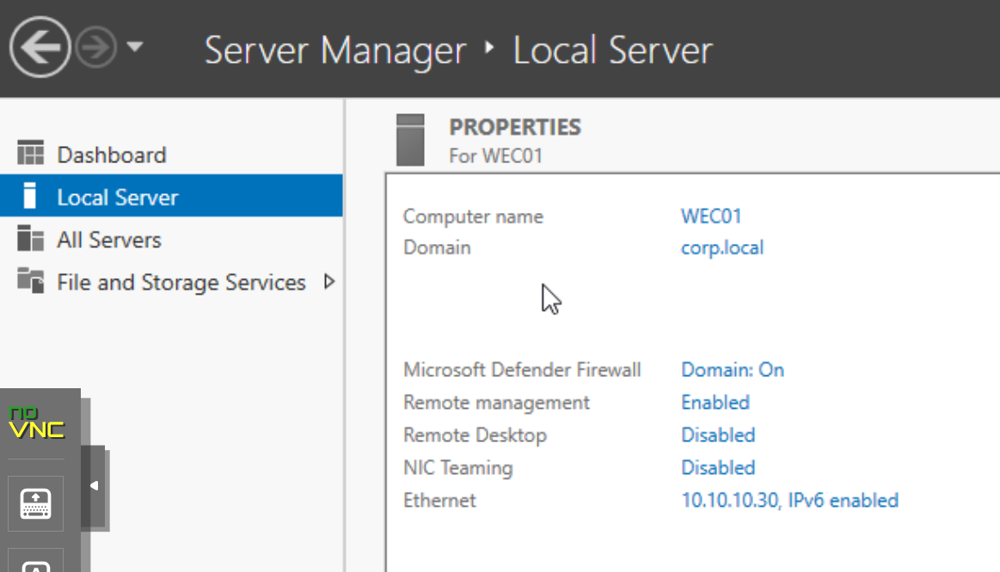
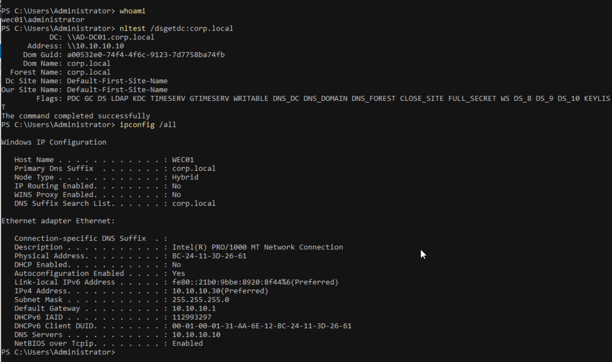
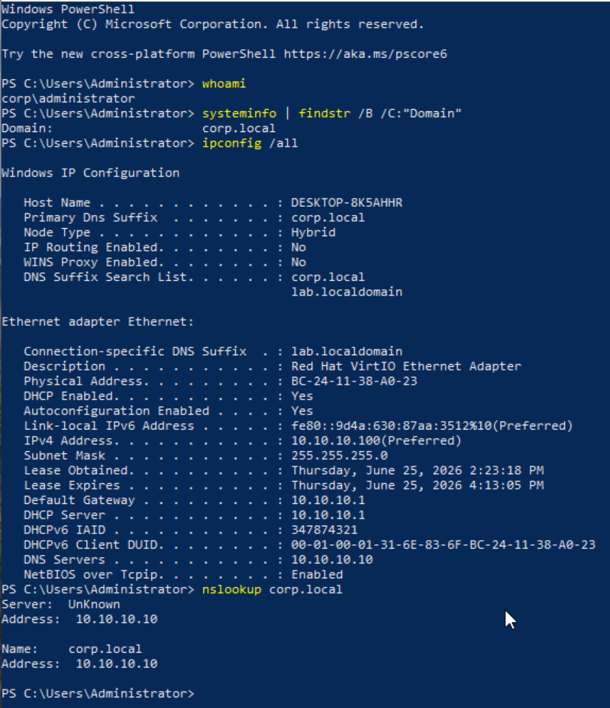
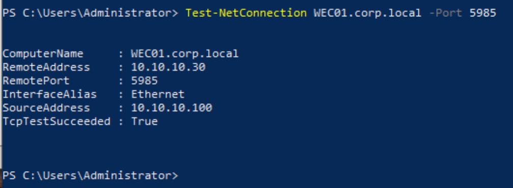

# Screenshots

Evidence screenshots from completed milestones. Each image proves a specific validation claim.

---

## Milestone 6 — Logging Foundation

### Infrastructure

**SIEM-SPLUNK01 IP confirmed at 10.10.10.20**

`ip a` output on SIEM-SPLUNK01 (SIEM — Security Information and Event Management — a platform that collects, stores, and searches log data from many sources) showing `inet 10.10.10.20/24` on `enp6s18`. Confirms Splunk is reachable on the expected management network address.

---

**Splunk service running on SIEM-SPLUNK01**

`systemctl status Splunkd.service` showing active (running). Confirms Splunk is live and will accept incoming data.

---

**Splunk Web UI reachable from TEST-WIN10-LAN1**

Splunk Enterprise login page loaded at `http://10.10.10.20:8000` in a browser on TEST-WIN10-LAN1. Confirms the Web UI is accessible from the LAN1 segment.

---

### pfSense Syslog Ingestion

**Splunk UDP 5514 input created**

Splunk Add Data wizard confirming UDP (User Datagram Protocol — a fast, connectionless way to send data over a network, common for log delivery) input on port 5514 was created. This is the listening endpoint for pfSense (an open-source firewall and router acting as the network gateway in this lab) syslog (a standard format that network devices like firewalls use to send log messages).

---

**pfSense remote logging configured to 10.10.10.20:5514**

pfSense Remote Logging Options page with Enable Remote Logging checked, remote log server set to `10.10.10.20:5514`, and "Everything" selected. Confirms pfSense is forwarding all syslog categories to Splunk.

---

**pfSense events visible in Splunk**

Splunk search `index=main sourcetype=syslog` returning 901 events. `host=10.10.10.1`, `source=udp:5514`, filterlog (pfSense's built-in logging format for firewall rule activity) entries visible. Validates end-to-end pfSense syslog ingestion (the process of receiving log data into a platform like Splunk).

---

### Windows Universal Forwarder Ingestion

**Splunk TCP 9997 receiving port enabled**

Splunk "Receive data" page showing port 9997 with status Enabled. Required for the Splunk Universal Forwarder (a lightweight agent installed on an endpoint that ships its logs to a central SIEM) on TEST-WIN10-LAN1 to connect. Port 9997 uses TCP (Transmission Control Protocol — a reliable, connection-based way to send data that confirms delivery).

---

**Windows Security events visible in Splunk**

Splunk search `index=* sourcetype=WinEventLog*` returning 17 events. `host=DESKTOP-8K5AHHR`, `sourcetype=WinEventLog:Security` (sourcetype — a label Splunk uses to identify what kind of log data came in, so it knows how to parse it). Validates end-to-end Windows Event Log ingestion via Splunk Universal Forwarder.

---

## Milestone 7 — Collector Placement and First Endpoint Prep

### WEC01 Collector Domain Join

**WEC01 joined to corp.local**

Server Manager Local Server view showing `WEC01` with domain `corp.local` and Ethernet address `10.10.10.30`. Confirms the dedicated Windows Event Collector candidate is no longer in a workgroup and is joined to the Active Directory domain.

---

**WEC01 domain controller discovery and network settings validated**

PowerShell output showing `nltest /dsgetdc:corp.local` locating `AD-DC01.corp.local` at `10.10.10.10`, with successful command completion. `ipconfig /all` confirms host name `WEC01`, primary DNS suffix `corp.local`, static IPv4 address `10.10.10.30`, default gateway `10.10.10.1`, and DNS server `10.10.10.10`.

### TEST-WIN10-LAN1 Endpoint Readiness

**TEST-WIN10-LAN1 domain and DNS readiness validated**

PowerShell output from `TEST-WIN10-LAN1` showing `whoami` as `corp\administrator`, `systeminfo` showing domain `corp.local`, `ipconfig /all` showing `AD-DC01` (`10.10.10.10`) as DNS, and `nslookup corp.local` resolving through `10.10.10.10`. Confirms the first Windows endpoint is domain-joined and using Active Directory DNS.

---

**TEST-WIN10-LAN1 WinRM reachability to WEC01 validated**

PowerShell `Test-NetConnection WEC01.corp.local -Port 5985` showing `TcpTestSucceeded : True`. Confirms the endpoint can reach the selected WEF collector on the WinRM transport path used by future WEF configuration. ICMP ping to `WEC01` is blocked or unvalidated, but the WEF-relevant TCP path is reachable.
